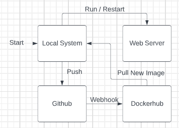

# Project Overview

- what is the point of this project and what tools are used
	- This project is used to familiarize ourselves with the tools of Github and Docker designed to make deployment and maintaining of webservers more convenient and efficient. This project also serves to familiarize ourselves with workflows, and the combination of these tools to have work automated in order to make the process of development more efficient.
- Part 4 - Diagramming goes here


# Run Project Locally

- how you installed docker + dependencies (WSL2, for example)
```bash
$ sudo apt-get update
$ sudo apt-get install \
    ca-certificates \
    curl \
    gnupg \
    lsb-release
$ sudo mkdir -p /etc/apt/keyrings
$ curl -fsSL https://download.docker.com/linux/ubuntu/gpg | sudo gpg --dearmor -o /etc/apt/keyrings/docker.gpg
$ echo \
  "deb [arch=$(dpkg --print-architecture) signed-by=/etc/apt/keyrings/docker.gpg] https://download.docker.com/linux/ubuntu \
  $(lsb_release -cs) stable" | sudo tee /etc/apt/sources.list.d/docker.list > /dev/null
$ sudo apt-get install docker-ce docker-ce-cli containerd.io docker-compose-plugin
$ sudo service docker start
```

- how to build the container
	- After creating a Dockerfile, you can run `docker build -t servername` (`webserver` in my case)
- how to run the container
	- `docker run -d -p serverport:80 servername` (`3000` and `webserver` in my case)
- how to view the project running in the container (open a browser...go to ip and port...)
	- go to http://localhost:serverport/ (`3000` in my case)

# DockerHub

- Process to create public repo in DockerHub
	- After making an account, you're taken through a guided creation process where you name a repo, provide a description and readme, and place it on DockerHub, ignoring all of the buttons that are asking you if you want to make it private.
- How to authenticate with DockerHub via CLI using Dockerhub credentials
	- Go to `Account Settings` then `Security` then generate an access token
	- then on the command line you can use `docker login -u Username`
	- then paste the key in place of the password
  - what credentials would you recommend providing?
	- Access Token
- How to push container to Dockerhub
	- `docker push <hub-user>/<repo-name>:<tag>`

# GitHub Actions

- Configuring GitHub Secrets
  - What secrets were set based on what info
	- It is neccesary to set a secret for your username, password, and token for Docker
- Behavior of GitHub workflow
  - what does it do and when
	The workflow pushes a build of the image to docker after a changed Dockerfile is pushed to the github repo
  - what variables in workflow are custom to your project
	- My own password, username, and token are specific to my repo and docker account, and would need to be changed if someone else were to implement this

# Deployment

- Description of container restart script
	- The script first stops the old webserver, removes the image from the local system, pulls a fresh image from Dockerhub, and then runs the new image (with a check to restart)
- Setting up a webhook on the server
  - How you created you own listener
	- Setup the listener on AWS to listen to the github url (with token)
  - How you installed the [webhook on GitHub](https://github.com/adnanh/webhook)
	- Set up the json file on the external server, and had it listen to the repo
  - How to keep the webhook running if the instance is on
	- Running the restart script detatched will persist so long as the instance is running
- Description of Webhook task definition file
	- The name of the hook, the command it will be executing, and the directory in which it works
- Steps to set up a notifier in GitHub or DockerHub
	- setup the listener to listen to the url in question (and token), and it will be activated when the provided event occurs
